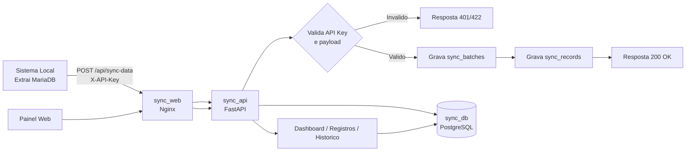
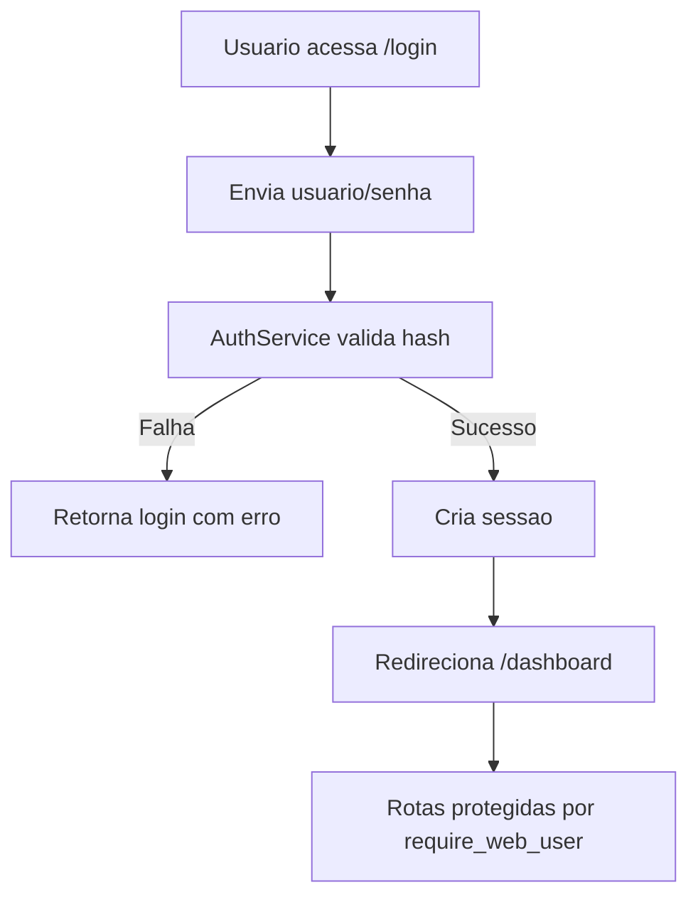
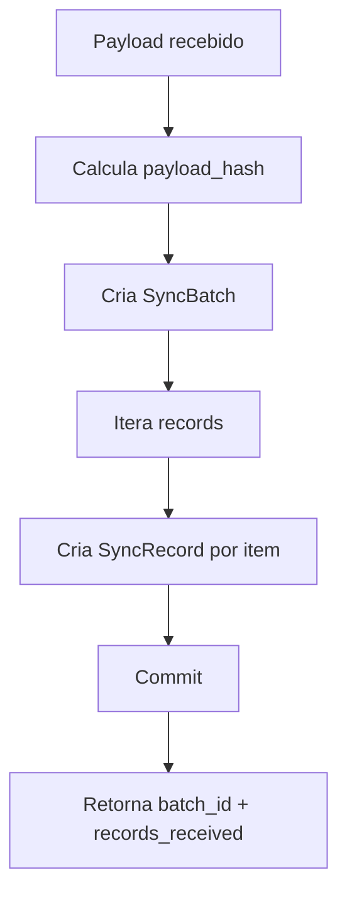

# Fluxograma Atual

## Fluxo funcional (alto nivel)

## Fluxo de autenticacao do painel

## Fluxo de persistencia da sincronizacao

## Pontos de controle
- Entrada API: `POST /api/sync-data`
- Health: `GET /health`
- Painel: `/login`, `/dashboard`, `/records`, `/history`, `/settings`
- Banco:
  - `sync_batches` para historico do envio
  - `sync_records` para dados detalhados

## Onde paramos
- Fluxo completo ponta a ponta implementado e validado localmente.
- Ambiente Docker com 3 servicos operacional.
- Documentacao de operacao e troubleshooting finalizada.

